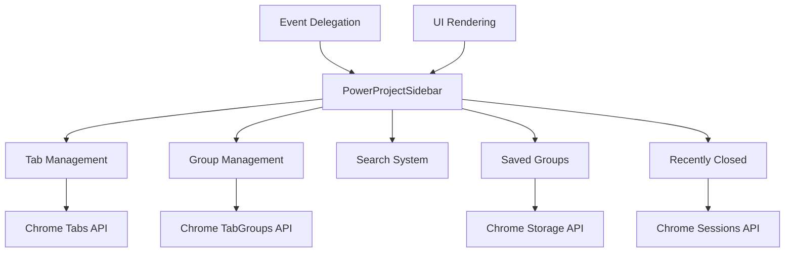

# System Patterns - Power Project Chrome Extension

## Architecture Overview

The extension follows a modular architecture with clear separation of concerns:

```
power-project/
├── manifest.json      # Extension configuration
├── background.js      # Background service worker
├── sidebar.html       # Sidebar UI structure
├── sidebar.js         # Main UI logic and event handling
├── sidebar.css        # Styling
└── popup.html/js      # Extension popup (if applicable)
```

## Key Design Patterns

### 1. Class-Based Architecture

- Main functionality encapsulated in `PowerProjectSidebar` class
- State management through class properties
- Clear method organization by feature area

### 2. Event Delegation Pattern

- Single event listener on document for all dynamic content
- Uses `data-*` attributes for action identification
- Reduces memory overhead and simplifies event management

### 3. State Management

- Local state stored in class properties:
  - `tabs`, `groups`, `recentlyClosed`, `savedGroups`
  - `collapsedSections`, `collapsedGroups`, `collapsedSavedGroups`
  - `selectedTabs` for bulk operations
- Persistent state in Chrome storage API

### 4. Render Pattern

- Separate render methods for each section
- HTML string generation for performance
- Full re-render on state changes

## Component Relationships



## Data Flow

1. **Initialization**: Load data from Chrome APIs → Store in class properties → Render UI
2. **User Action**: Click event → Event delegation → Action handler → Update state → Re-render
3. **Chrome Events**: Tab/group changes → Update local state → Re-render affected sections

## Critical Implementation Paths

### Saved Groups Flow

1. Save: Current tabs → Format data → Store in chrome.storage → Update UI
2. Restore: Retrieve from storage → Create tabs → Group tabs → Update UI
3. Delete: Remove from storage → Update local state → Re-render

### Event Handling Architecture

- All clicks handled through single document listener
- Action identification through DOM traversal and data attributes
- Consistent pattern: Find element → Extract ID → Call handler → Update state

## Performance Considerations

- Debounced refresh to prevent rapid re-renders
- Minimal DOM updates through section-specific rendering
- Efficient event delegation instead of individual listeners
- State caching to reduce Chrome API calls
